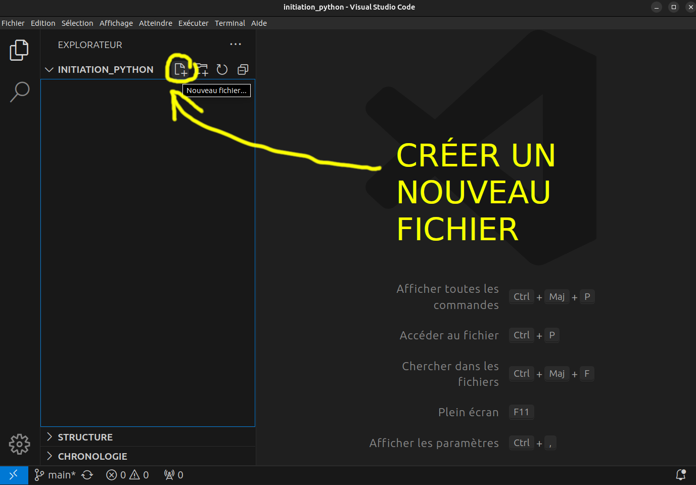
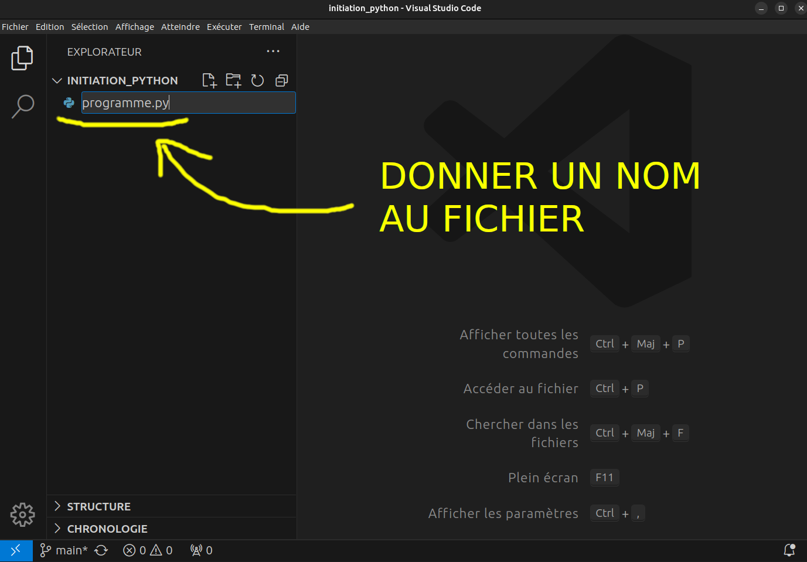
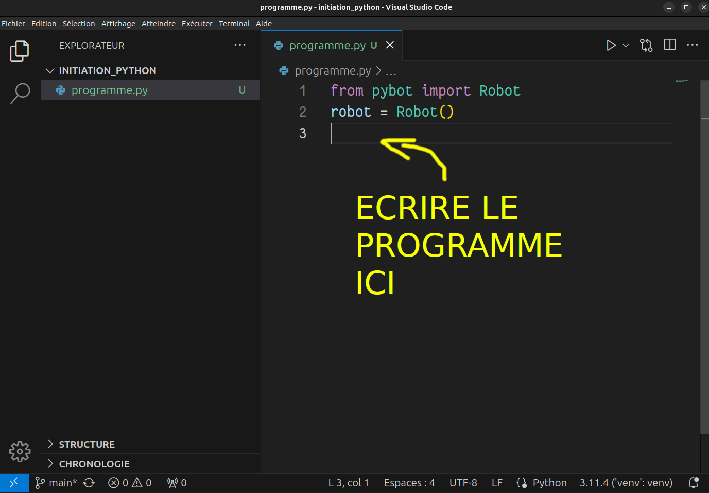
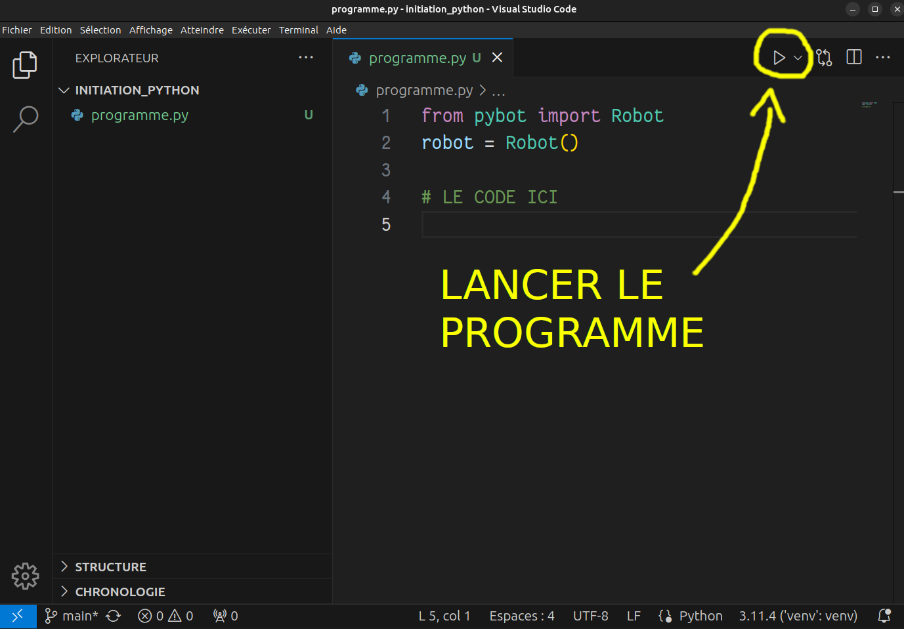

---

marp: true
theme: gaia
class: lead
paginate: true
_backgroundImage: url('./1.png')

---
---

# Ouvrir l'explorateur de fichiers

---

---

# Créer un nouveau fichier

---

---

# Nommer le fichier

---

---
# Écrire son code dans le fichier

---

---
# Lancer le programme

---

